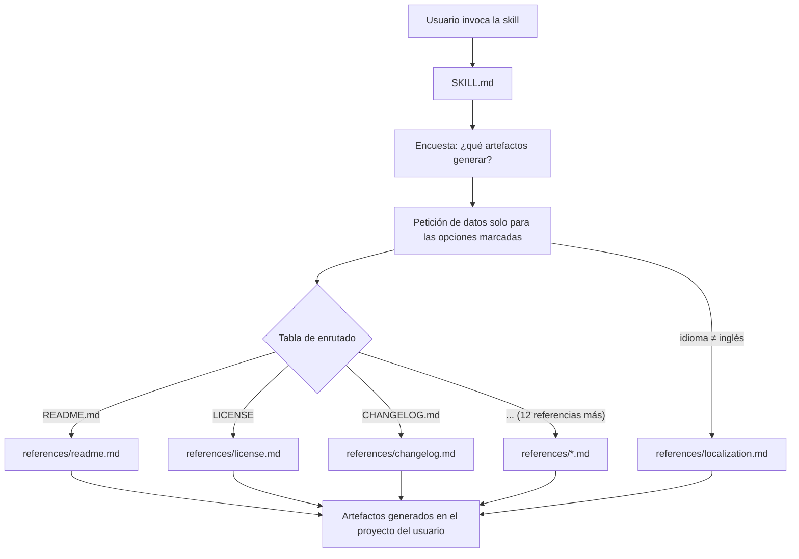

# open-source

[](https://skills.sh/igarbayo/open-source)
[](https://api.reuse.software/info/github.com/igarbayo/open-source)
[](https://scorecard.dev/viewer/?uri=github.com/igarbayo/open-source)
<!-- OpenSSF Best Practices: descomentar cuando el proyecto esté registrado en
     https://www.bestpractices.dev/ (entrar con GitHub → "Get your badge now"),
     sustituyendo {{ID}} por el identificador numérico que asigna el sitio.
[](https://www.bestpractices.dev/projects/{{ID}})
-->

[English](README.md) · **Español**

```bash
npx skills add igarbayo/open-source
```

Skill en formato **Agent Skills** (estándar abierto) para **Claude Code** y **OpenCode** que configura la gobernanza open source completa de un proyecto siguiendo las buenas prácticas de la FSF y la OSI. Resuelve el problema de arrancar (o liberar) un repositorio open source, de **hackathon** o real.

Evita tener que recordar qué documentos hacen falta, qué debe contener cada uno o dónde va cada fichero. La skill pregunta qué partes se quieren implementar y genera solo esas, pidiendo únicamente los datos relevantes.

> Las instrucciones de la skill están escritas en inglés, pero **la documentación que genera puede estar en cualquier idioma**: es una de las preguntas que hace, con inglés por defecto.

El comando de arriba funciona en cualquier agente que detecte la [CLI de skills](https://github.com/vercel-labs/skills). Las demás vías — marketplace de Claude Code, clon manual, OpenCode — están en [Instalación](#instalación).

## Características

La skill puede generar, a elección del usuario mediante una encuesta inicial, los siguientes artefactos:

| Artefacto | Descripción |
|---|---|
| **README.md** | Punto de entrada del proyecto: propósito, instalación, ejemplos, troubleshooting. |
| **LICENSE** | Licencia OSI (MIT, Apache-2.0, BSD-3-Clause, GPL-3.0, AGPL-3.0) con recomendación guiada. |
| **REUSE.toml** | Metadatos de licencia conformes con la especificación REUSE/SPDX. |
| **CONTRIBUTING.md** | Guía para contribuidores, incluyendo setup, estilo, commits, tiempos de revisión. |
| **SECURITY.md** | Política de seguridad alineada con el EU CRA. |
| **CODE_OF_CONDUCT.md** | Código de conducta basado en el Contributor Covenant. |
| **GOVERNANCE.md** | Toma de decisiones, roles y resolución de conflictos. |
| **CHANGELOG.md** | Historial de cambios en formato Keep a Changelog. |
| **Plantillas de issues y pull requests** | En `.github/`. |
| **Workflows de GitHub Actions** | En `.github/workflows/` (build, lint, test, seguridad). |
| **Dependabot** | En `.github/`, para actualizaciones automáticas de dependencias y CVEs. |
| **Conventional commits** | Convención de mensajes de commit. |
| **Autenticación de commits con GPG + DCO** | Firma y certificación de origen de los commits. |
| **Git flow y pull requests** | Flujo de ramas y revisión. |
| **ARCHITECTURE_DECISIONS.md** | Registro de decisiones de diseño. |

Toda la documentación generada está escrita en lenguaje natural, orientada a humanos y con ejemplos.

## Arquitectura

La skill usa *progressive disclosure*: `SKILL.md` contiene la encuesta y una tabla de enrutado; el detalle de cada artefacto vive en un fichero de `references/` que solo se carga si su opción fue marcada, manteniendo acotado el coste de contexto.



## Instalación

### Un solo comando, cualquier agente (lo más rápido)

```bash
# En el proyecto actual (.claude/skills/, .opencode/skills/…)
npx skills add igarbayo/open-source

# O una vez para todos los proyectos
npx skills add igarbayo/open-source --global
```

La [CLI de skills](https://github.com/vercel-labs/skills) detecta qué agentes de código tienes instalados y escribe la skill en la carpeta de cada uno; si no detecta ninguno, pregunta. `npx skills update` la actualiza y `npx skills remove` la desinstala. Cubre igual a Claude Code y a OpenCode, así que es la vía más corta salvo que quieras específicamente la maquinaria de `/plugin` de abajo.

### Claude Code, vía marketplace

Desde una sesión de Claude Code:

```
/plugin marketplace add igarbayo/open-source
/plugin install open-source@igarbayo
```

Es la vía nativa de Claude Code y gestiona la skill como plugin versionado: cuando se publica una versión nueva, basta con

```
/plugin marketplace update igarbayo
/plugin update open-source@igarbayo
```

### Claude Code, vía clon manual (alternativa)

Si prefieres no usar el marketplace:

```bash
# Personal (disponible en todos los proyectos)
git clone https://github.com/igarbayo/open-source.git ~/.claude/skills/open-source

# O por proyecto
git clone https://github.com/igarbayo/open-source.git .claude/skills/open-source
```

Como el repositorio incluye `.claude-plugin/plugin.json`, Claude Code lo carga como plugin `open-source@skills-dir` en vez de como skill suelta, así que la invocación es la misma que con el marketplace. Dos avisos para la instalación por proyecto: requiere aceptar el diálogo de confianza del workspace, y hay que arrancar Claude Code desde la raíz del repositorio (los plugins de `@skills-dir` no se buscan hacia arriba desde un subdirectorio).

### OpenCode

```bash
# Personal (disponible en todos los proyectos)
git clone https://github.com/igarbayo/open-source.git ~/.config/opencode/skills/open-source

# O por proyecto
git clone https://github.com/igarbayo/open-source.git .opencode/skills/open-source
```

OpenCode no tiene sistema de plugins: ignora `.claude-plugin/` y carga el repositorio como skill normal. También lee las carpetas de Claude Code (`~/.claude/skills/` y `.claude/skills/`): si ya la clonaste ahí, la detecta sin volver a clonar.

## Uso

Desde una sesión de **Claude Code** u **OpenCode** en el proyecto que quieres documentar, invoca la skill. El comando depende de cómo la hayas instalado, porque como plugin queda bajo su propio espacio de nombres:

| Instalación | Se carga como | Invocación |
|---|---|---|
| Marketplace | plugin `open-source@igarbayo` | `/open-source:open-source` |
| `npx skills add`, en Claude Code | plugin `open-source@skills-dir` | `/open-source:open-source` |
| `npx skills add`, en OpenCode | skill normal | `/open-source` |
| Clon en `~/.claude/skills/` o `.claude/skills/` | plugin `open-source@skills-dir` | `/open-source:open-source` |
| Clon en OpenCode | skill normal | `/open-source` |

En todos los casos puedes simplemente pedirlo en lenguaje natural, sin recordar el comando:

```
Configura la gobernanza open source de este proyecto
```

La skill hará entonces dos rondas de preguntas:

1. **Encuesta de opción múltiple** con las partes de la estrategia open source a implementar (README, LICENSE, REUSE.toml, CONTRIBUTING, SECURITY, plantillas de `.github/`, etc., o todo lo anterior).
2. **Datos relevantes solo para lo marcado**: idioma de la documentación (inglés por defecto), nombre del proyecto, licencia elegida, mantenedores, nombre del hackathon si aplica, reglas de gobernanza…

Con esas respuestas genera los ficheros directamente en tu proyecto, en las rutas estándar (raíz, `docs/`, `.github/`).

Si eliges un idioma distinto del inglés, la skill carga además `references/localization.md` y aplica sus convenciones tipográficas (en español y gallego: capitalización solo de la primera palabra en los encabezados, y la raya reservada para incisos).

## Compatibilidad

- Requiere una CLI compatible con el formato **Agent Skills**: **Claude Code** u **OpenCode**.
- **`npx skills`**: la [CLI de skills](https://github.com/vercel-labs/skills) instala en cualquiera de esos agentes que encuentre, así que es la vía común para ambos. Necesita Node.js.
- **Claude Code**: por marketplace (requiere una versión con soporte de plugins, `/plugin`), o clonada a nivel **personal** (`~/.claude/skills/`) o de **proyecto** (`.claude/skills/`).
- **OpenCode**: no tiene marketplace de plugins, así que su vía es el clon. Rutas propias `~/.config/opencode/skills/` (personal) y `.opencode/skills/` (proyecto); además lee `~/.claude/skills/` y `.claude/skills/`, por lo que reutiliza la instalación de Claude Code.

## Troubleshooting

| Problema | Causa y solución |
|---|---|
| `npx skills add` termina pero el agente no ve la skill | La CLI instala en el **proyecto actual** salvo que pases `--global`, y hay que reiniciar la sesión para que detecte una skill nueva. Comprueba dónde ha quedado con `npx skills list`. |
| `/plugin install` no encuentra el plugin | El catálogo local está desactualizado. Ejecuta `/plugin marketplace update igarbayo` y vuelve a intentarlo. Comprueba lo que tienes instalado con `claude plugin list`. |
| Instalé por marketplace pero `/open-source` no existe | Como plugin, el comando está bajo su espacio de nombres: es `/open-source:open-source`. Ver la tabla de la sección [Uso](#uso). |
| La skill se carga pero falla al generar un artefacto | La tabla de enrutado usa rutas relativas (`references/*.md`). No muevas la carpeta `references/` ni renombres sus ficheros. |
| Genera documentación en un idioma inesperado | El idioma por defecto es inglés, independientemente del idioma en el que hables con la skill; indícalo explícitamente cuando pregunte los datos. |

## Contribuir

Las contribuciones son bienvenidas y [CONTRIBUTING.md](CONTRIBUTING.md) explica el flujo completo: cómo instalar tu copia de trabajo en un agente, cómo probar un cambio (una skill es un prompt, así que la única prueba real es ejecutarla y leer lo que sale), el convenio de commits y la definición de terminado. El [CODE_OF_CONDUCT.md](CODE_OF_CONDUCT.md) se aplica a todos los espacios del proyecto.

Los tiempos de revisión son honestos y no halagadores: el mantenedor es estudiante y un pull request puede esperar semanas en época de exámenes.

## Seguridad

Las vulnerabilidades no se reportan en un issue público. [SECURITY.md](SECURITY.md) describe los canales privados y qué entra en el alcance, incluida la superficie fácil de pasar por alto en un repositorio de Markdown: su contenido se carga en un agente de código y le indica a ese agente que escriba ficheros en tu proyecto.

## Soporte

¿Dudas, errores o propuestas de mejora? Abre un [issue en GitHub](https://github.com/igarbayo/open-source/issues).

## Licencia

Este proyecto se distribuye bajo la licencia [MIT](LICENSE). Como todo software open source, se proporciona **sin garantías de ningún tipo** (*no warranties*).

El repositorio se aplica a sí mismo los metadatos de licencia que genera la skill: el texto completo está en [LICENSES/MIT.txt](LICENSES/MIT.txt) y todos los archivos quedan atribuidos mediante [REUSE.toml](REUSE.toml), de modo que `pipx run reuse lint` pasa en la raíz.
