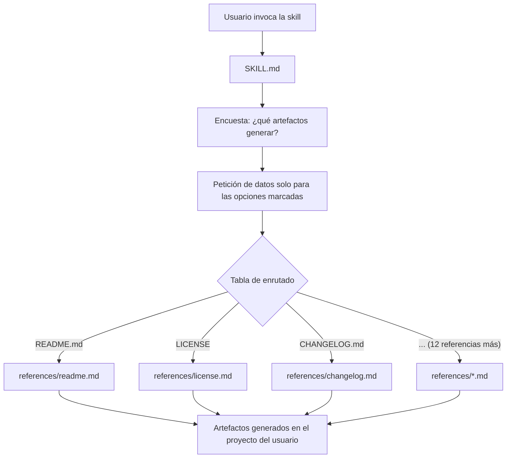

# open-source

Skill en formato **Agent Skills** (estándar abierto) para **Claude Code** y **OpenCode** que configura la gobernanza open source completa de un proyecto siguiendo las buenas prácticas de la FSF y la OSI. Resuelve el problema de arrancar (o liberar) un repositorio open source, de **hackathon** o real.

Evita tener que recordar qué documentos hacen falta, qué debe contener cada uno o dónde va cada fichero. La skill pregunta qué partes se quieren implementar y genera solo esas, pidiendo únicamente los datos relevantes.

## Características

La skill puede generar, a elección del usuario mediante una encuesta inicial, los siguientes artefactos:

| Artefacto | Descripción |
|---|---|
| **README.md** | Punto de entrada del proyecto: propósito, instalación, ejemplos, troubleshooting. |
| **LICENSE** | Licencia OSI (MIT, Apache-2.0, BSD-3-Clause, GPL-3.0, AGPL-3.0) con recomendación guiada. |
| **REUSE.toml** | Metadatos de licencia conformes con la especificación REUSE/SPDX. |
| **CONTRIBUTING.md** | Guía para contribuidores, incluyendo setup, estilo, commits, tiempos de revisión. |
| **SECURITY.md** | Política de seguridad alineada con el EU CRA. |
| **CODE_OF_CONDUCT.md** | Código de conducta basado en el Contributor Covenant. |
| **GOVERNANCE.md** | Toma de decisiones, roles y resolución de conflictos. |
| **CHANGELOG.md** | Historial de cambios en formato Keep a Changelog. |
| **Plantillas de issues y pull requests** | En `.github/`. |
| **Workflows de GitHub Actions** | En `.github/workflows/` (build, lint, test, seguridad). |
| **Dependabot** | En `.github/`, para actualizaciones automáticas de dependencias y CVEs. |
| **Conventional commits** | Convención de mensajes de commit. |
| **Autenticación de commits con GPG + DCO** | Firma y certificación de origen de los commits. |
| **Git flow y Pull Requests** | Flujo de ramas y revisión. |
| **ARCHITECTURE_DECISIONS.md** | Registro de decisiones de diseño. |

Toda la documentación generada está escrita en lenguaje natural, orientada a humanos y con ejemplos.

## Arquitectura

La skill usa *progressive disclosure*: `SKILL.md` contiene la encuesta y una tabla de enrutado; el detalle de cada artefacto vive en un fichero de `references/` que solo se carga si su opción fue marcada, manteniendo acotado el coste de contexto.



## Instalación

**Claude Code**:

```bash
# Personal (disponible en todos los proyectos)
git clone https://github.com/igarbayo/open-source.git ~/.claude/skills/open-source

# O por proyecto
git clone https://github.com/igarbayo/open-source.git .claude/skills/open-source
```

**OpenCode**:

```bash
# Personal (disponible en todos los proyectos)
git clone https://github.com/igarbayo/open-source.git ~/.config/opencode/skills/open-source

# O por proyecto
git clone https://github.com/igarbayo/open-source.git .opencode/skills/open-source
```

OpenCode también lee las carpetas de Claude Code (`~/.claude/skills/` y `.claude/skills/`): si ya instalaste la skill ahí, Opencode la detecta sin volver a clonar.

## Uso

Desde una sesión de **Claude Code** u **OpenCode** en el proyecto que quieres documentar, invoca la skill:

```
/open-source
```

o simplemente pídelo en lenguaje natural:

```
Configura la gobernanza open source de este proyecto
```

La skill hará entonces dos rondas de preguntas:

1. **Encuesta de opción múltiple** con las partes de la estrategia open source a implementar (README, LICENSE, REUSE.toml, CONTRIBUTING, SECURITY, plantillas de `.github/`, etc., o todo lo anterior).
2. **Datos relevantes solo para lo marcado**: idioma de la documentación (inglés por defecto), nombre del proyecto, licencia elegida, mantenedores, nombre del hackathon si aplica, reglas de gobernanza…

Con esas respuestas genera los ficheros directamente en tu proyecto, en las rutas estándar (raíz, `docs/`, `.github/`).

## Compatibilidad

- Requiere una CLI compatible con el formato **Agent Skills**: **Claude Code** u **OpenCode**.
- **Claude Code**: instalada a nivel **personal** (`~/.claude/skills/`) o de **proyecto** (`.claude/skills/`).
- **OpenCode**: rutas propias `~/.config/opencode/skills/` (personal) y `.opencode/skills/` (proyecto); además lee `~/.claude/skills/` y `.claude/skills/`, por lo que reutiliza la instalación de Claude Code.

## Troubleshooting

| Problema | Causa y solución |
|---|---|
| La skill no aparece / no se descubre | La carpeta donde se clona debe llamarse exactamente `open-source`, coincidiendo con el `name:` del frontmatter de `SKILL.md`. Renombra la carpeta si la clonaste con otro nombre. |
| La skill se carga pero falla al generar un artefacto | La tabla de enrutado usa rutas relativas (`references/*.md`). No muevas la carpeta `references/` ni renombres sus ficheros. |
| Genera documentación en un idioma inesperado | El idioma por defecto es inglés; indícalo explícitamente cuando la skill pregunte los datos. |

## Soporte

¿Dudas, errores o propuestas de mejora? Abre un [issue en GitHub](https://github.com/igarbayo/open-source/issues).

## Licencia

Este proyecto se distribuye bajo la licencia [MIT](LICENSE). Como todo software open source, se proporciona **sin garantías de ningún tipo** (*no warranties*).
