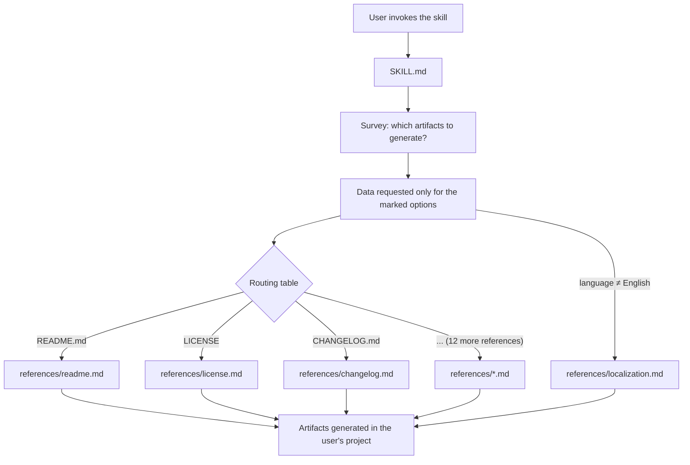

# open-source

[](https://skills.sh/igarbayo/open-source)
[](https://api.reuse.software/info/github.com/igarbayo/open-source)
[](https://scorecard.dev/viewer/?uri=github.com/igarbayo/open-source)
<!-- OpenSSF Best Practices: uncomment once the project is registered at
     https://www.bestpractices.dev/ (sign in with GitHub → "Get your badge now"),
     replacing {{ID}} with the numeric project id the site assigns.
[](https://www.bestpractices.dev/projects/{{ID}})
-->

**English** · [Español](README.es.md)

```bash
npx skills add igarbayo/open-source
```

A skill in the **Agent Skills** format (an open standard) for **Claude Code** and **OpenCode** that sets up the complete open source governance of a project following FSF and OSI best practices. It solves the problem of starting (or releasing) an open source repository, whether it comes from a **hackathon** or from real work.

It removes the need to remember which documents are required, what each one must contain, or where each file goes. The skill asks which parts you want to implement, generates only those, and asks only for the data they need.

> The skill's instructions are written in English, but **the documentation it generates can be in any language**: that is one of the questions it asks, with English as the default.

The command above works on any agent the [skills CLI](https://github.com/vercel-labs/skills) detects. The other routes — Claude Code marketplace, manual clone, OpenCode — are in [Installation](#installation).

## Features

Through an initial survey, the skill can generate the following artifacts at the user's choice:

| Artifact | Description |
|---|---|
| **README.md** | Project entry point: purpose, installation, examples, troubleshooting. |
| **LICENSE** | OSI license (MIT, Apache-2.0, BSD-3-Clause, GPL-3.0, AGPL-3.0) with a guided recommendation. |
| **REUSE.toml** | Licensing metadata compliant with the REUSE/SPDX specification. |
| **CONTRIBUTING.md** | Contributor guide, covering setup, style, commits and review times. |
| **SECURITY.md** | Security policy aligned with the EU CRA. |
| **CODE_OF_CONDUCT.md** | Code of conduct based on the Contributor Covenant. |
| **GOVERNANCE.md** | Decision-making, roles and conflict resolution. |
| **CHANGELOG.md** | Change history in Keep a Changelog format. |
| **Issue and pull request templates** | In `.github/`. |
| **GitHub Actions workflows** | In `.github/workflows/` (build, lint, test, security). |
| **Dependabot** | In `.github/`, for automatic dependency and CVE updates. |
| **Conventional commits** | Commit message convention. |
| **Commit authentication with GPG + DCO** | Commit signing and certificate of origin. |
| **Git flow and pull requests** | Branching and review flow. |
| **ARCHITECTURE_DECISIONS.md** | Record of design decisions. |

All the generated documentation is written in natural language, aimed at humans and full of examples.

## Architecture

The skill uses *progressive disclosure*: `SKILL.md` holds the survey and a routing table; the details of each artifact live in a `references/` file that is loaded only if its option was marked, which keeps the context cost bounded.


```mermaid
flowchart TD
    A[User invokes the skill] --> B[SKILL.md]
    B --> C[Survey: which artifacts to generate?]
    C --> D[Data requested only for the marked options]
    D --> E{Routing table}
    E -->|README.md| R1[references/readme.md]
    E -->|LICENSE| R2[references/license.md]
    E -->|CHANGELOG.md| R3[references/changelog.md]
    E -->|"... (12 more references)"| R4[references/*.md]
    D -->|"language ≠ English"| R5[references/localization.md]
    R1 --> F[Artifacts generated in the user's project]
    R2 --> F
    R3 --> F
    R4 --> F
    R5 --> F
```

## Installation

### One command, any agent (fastest)

```bash
# In the current project (.claude/skills/, .opencode/skills/…)
npx skills add igarbayo/open-source

# Or once for every project
npx skills add igarbayo/open-source --global
```

The [skills CLI](https://github.com/vercel-labs/skills) detects which coding agents you have installed and writes the skill into each one's folder; if it detects none, it asks. `npx skills update` brings it up to date and `npx skills remove` uninstalls it. It covers Claude Code and OpenCode alike, so it is the shortest route unless you specifically want the `/plugin` machinery below.

### Claude Code, via marketplace

From a Claude Code session:

```
/plugin marketplace add igarbayo/open-source
/plugin install open-source@igarbayo
```

This route is native to Claude Code and manages the skill as a versioned plugin: when a new version is published, all it takes is

```
/plugin marketplace update igarbayo
/plugin update open-source@igarbayo
```

### Claude Code, via manual clone (alternative)

If you would rather not use the marketplace:

```bash
# Personal (available in every project)
git clone https://github.com/igarbayo/open-source.git ~/.claude/skills/open-source

# Or per project
git clone https://github.com/igarbayo/open-source.git .claude/skills/open-source
```

Because the repository includes `.claude-plugin/plugin.json`, Claude Code loads it as the plugin `open-source@skills-dir` rather than as a standalone skill, so invocation is the same as with the marketplace. Two caveats for the per-project install: it requires accepting the workspace trust dialog, and Claude Code must be started from the repository root (`@skills-dir` plugins are not searched for upwards from a subdirectory).

### OpenCode

```bash
# Personal (available in every project)
git clone https://github.com/igarbayo/open-source.git ~/.config/opencode/skills/open-source

# Or per project
git clone https://github.com/igarbayo/open-source.git .opencode/skills/open-source
```

OpenCode has no plugin system: it ignores `.claude-plugin/` and loads the repository as a regular skill. It also reads the Claude Code folders (`~/.claude/skills/` and `.claude/skills/`), so if you already cloned it there, it is picked up without cloning again.

## Usage

From a **Claude Code** or **OpenCode** session in the project you want to document, invoke the skill. The command depends on how you installed it, because as a plugin it lives under its own namespace:

| Installation | Loaded as | Invocation |
|---|---|---|
| Marketplace | plugin `open-source@igarbayo` | `/open-source:open-source` |
| `npx skills add`, on Claude Code | plugin `open-source@skills-dir` | `/open-source:open-source` |
| `npx skills add`, on OpenCode | regular skill | `/open-source` |
| Clone in `~/.claude/skills/` or `.claude/skills/` | plugin `open-source@skills-dir` | `/open-source:open-source` |
| Clone in OpenCode | regular skill | `/open-source` |

In every case you can simply ask for it in natural language, without remembering the command:

```
Set up the open source governance of this project
```

The skill then runs two rounds of questions:

1. **A multiple-choice survey** with the parts of the open source strategy to implement (README, LICENSE, REUSE.toml, CONTRIBUTING, SECURITY, `.github/` templates, etc., or all of the above).
2. **Data relevant only to what was marked**: documentation language (English by default), project name, chosen license, maintainers, hackathon name if applicable, governance rules…

With those answers it generates the files directly in your project, at the standard paths (root, `docs/`, `.github/`).

If you pick a language other than English, the skill additionally loads `references/localization.md` and applies its typographic conventions (for Spanish and Galician: sentence case in headings, and the em dash reserved for asides).

## Compatibility

- Requires a CLI compatible with the **Agent Skills** format: **Claude Code** or **OpenCode**.
- **`npx skills`**: the [skills CLI](https://github.com/vercel-labs/skills) installs into whichever of those agents it finds, so it is the common route for both. It needs Node.js.
- **Claude Code**: through the marketplace (requires a version with plugin support, `/plugin`), or cloned at the **personal** (`~/.claude/skills/`) or **project** (`.claude/skills/`) level.
- **OpenCode**: it has no plugin marketplace, so cloning is the way. It has its own paths, `~/.config/opencode/skills/` (personal) and `.opencode/skills/` (project); it also reads `~/.claude/skills/` and `.claude/skills/`, so it reuses the Claude Code installation.

## Troubleshooting

| Problem | Cause and fix |
|---|---|
| `npx skills add` finished but the agent does not see the skill | The CLI installs into the **current project** unless you pass `--global`, and the session has to be restarted to pick up a new skill. Check where it landed with `npx skills list`. |
| `/plugin install` cannot find the plugin | The local catalog is out of date. Run `/plugin marketplace update igarbayo` and try again. Check what you have installed with `claude plugin list`. |
| I installed via the marketplace but `/open-source` does not exist | As a plugin, the command lives under its namespace: it is `/open-source:open-source`. See the table in the [Usage](#usage) section. |
| The skill loads but fails while generating an artifact | The routing table uses relative paths (`references/*.md`). Do not move the `references/` folder or rename its files. |
| It generates documentation in an unexpected language | The default language is English, regardless of the language you speak to the skill in; state it explicitly when the skill asks for the data. |

## Contributing

Contributions are welcome, and [CONTRIBUTING.md](CONTRIBUTING.md) explains the whole flow: how to install your working copy into an agent, how to exercise a change (a skill is a prompt — the only real test is running it and reading the output), the commit convention and the definition of done. The [CODE_OF_CONDUCT.md](CODE_OF_CONDUCT.md) applies to every space in the project.

Review times are honest rather than flattering: the maintainer is a student and a pull request can wait weeks during term.

## Security

Do not report vulnerabilities in a public issue. [SECURITY.md](SECURITY.md) describes the private channels and what falls in scope — including the surface that is easy to miss in a repository of Markdown, namely that its content is loaded into a coding agent and tells that agent to write files into your project.

## Support

Questions, bugs or improvement ideas? Open an [issue on GitHub](https://github.com/igarbayo/open-source/issues).

## License

This project is distributed under the [MIT](LICENSE) license. Like all open source software, it is provided **with no warranties of any kind**.

The repository applies to itself the licensing metadata the skill generates: the full text lives in [LICENSES/MIT.txt](LICENSES/MIT.txt) and every file is attributed through [REUSE.toml](REUSE.toml), so `pipx run reuse lint` passes at the root.
